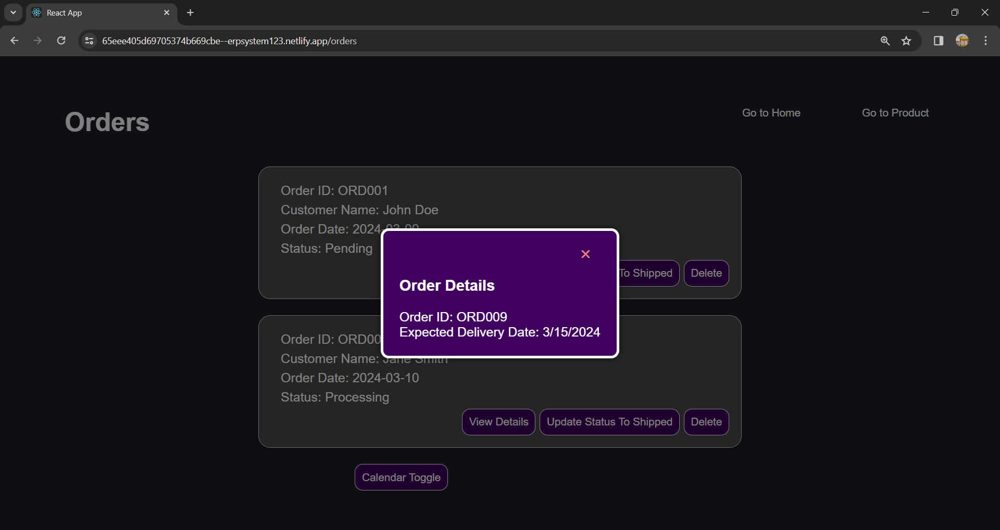

# ERP System with React

This project aims to create a simplified interface for an ERP (Enterprise Resource Planning) system using React. The system provides functionalities for managing products, orders, and a dashboard overview. Additionally, an optional feature of displaying orders on a calendar view is implemented.

## Project Overview

The ERP system consists of the following pages:

- **Dashboard:** Provides an overview of key metrics or features and allows quick navigation to the Products and Orders management pages.
- **Products Management:** Enables the management of product listings including functionalities to add, edit, and delete products.
- **Orders Management:** Facilitates viewing and handling of orders including functionalities to view order details, update order status, and delete orders.
- **Orders Calendar View:** Displays orders on their expected delivery dates in a calendar view and provides the ability to view all orders due for delivery on a specific day.This is implemented on Orders Page.

## Objectives

- Develop a user-friendly interface for managing key aspects of a business.
- Utilize React for building modular components and managing application state.
- Implement navigation between different sections of the ERP system using React Router.
- Create a responsive design suitable for both desktop and mobile devices.

## Technology Stack

- React

## Documentation

### Running the Application

To run the application locally, follow these steps:

1. Clone the repository to your local machine:

   ```
   git clone https://github.com/rajat-soni-12m/ERP-System.git
   ```

2. Navigate to the project directory:
    ```
    cd ERP-System
    ```

3. Install dependencies using npm:
    ```
    npm install
    ```

4. Start the development server:
   ```
   npm start
   ```
   
5. Open your browser and visit `http://localhost:3000` to view the application.

### Screenshots


*Figure 1: Dashboard overview*


*Figure 2: Products management page*


*Figure 3: Orders management page*




*Figure 4: Orders calendar view (optional feature)*

## Project Deployment

The project is deployed on [Netlify](https://65eee405d69705374b669cbe--erpsystem123.netlify.app).

Happy coding!


